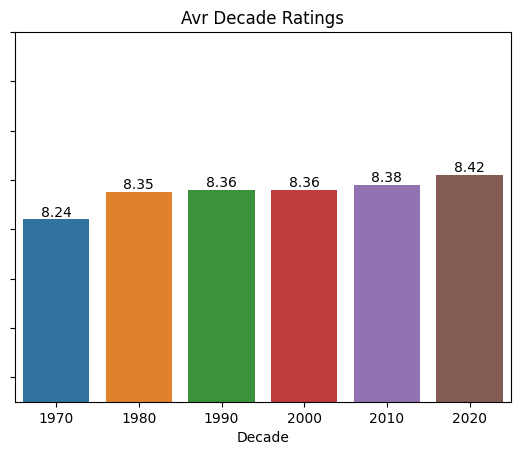
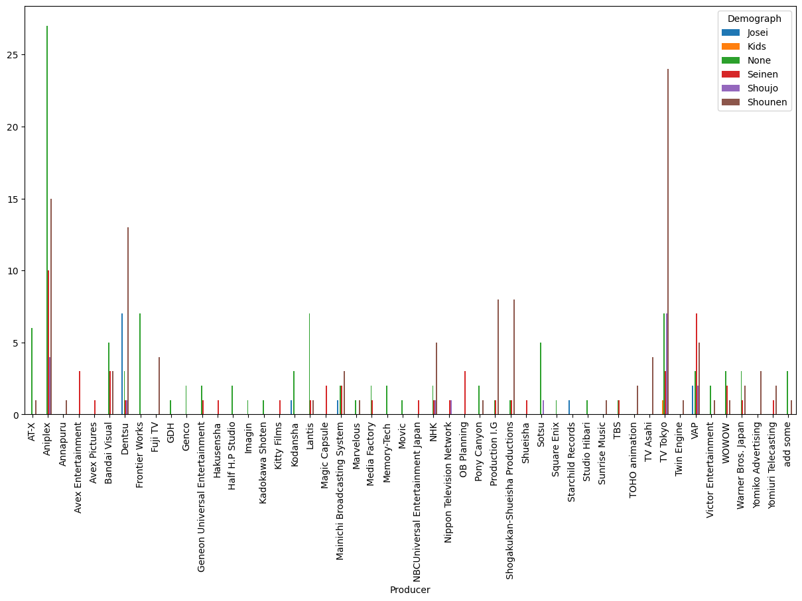

<h1> Analysis 1
<h2>  For TV Shows

 

 The folowing sections incluedes graphs aswell as interpretation of said graphs

<!-- 
    General Layout

#### (All cunt)
#### Premiered Season
#### Broadcast days
#### Studio
#### Age Rating
#### Genres
#### Producers
#### Demograph (All cunt)
#### Themes
#### Source
 -->

------
### __Release Stats__

#### &emsp; All Months Releases
The following graph shows in which months animes the most animes were releases.

According to this graph animes are released every 3 months, or quaterly.

#### &emsp; Seasonly

The following graph shows the amount of top animes was released in each season

We can see that the most animes were released in Fall, followed by Spring, Winter and Summer.

#### &emsp; Decades
<!--  -->

#### &nbsp; Broadcast days
#### &nbsp; Studio
#### &nbsp; Age Rating
#### &nbsp; Genres
#### &nbsp; Producers
#### &nbsp; Demograph (All cunt)
#### &nbsp; Themes
#### &nbsp; Source

<!------------------------>
------
### __Rating Stats__
This is the avr ratings of all animes

#### All

#### &nbsp; Premiered
##### &emsp; Season

###### &emsp; Montly

###### &emsp; Yearly (decade)

#### &nbsp; Broadcast days
#### &nbsp; Studio
#### &nbsp; Age Rating
#### &nbsp; Genres
#### &nbsp; Producers
#### &nbsp; Demograph (All cunt)
#### &nbsp; Themes
#### &nbsp; Source

<!-------------------------------------------------------------------------------------------->
------
### _Broadcast Stats_

#### &nbsp; Premiered
#### &emsp; Weekly

#### &emsp; Seasonly

#### &emsp; Yearly

    can put in a table
      maby change this style

 
can put in a table

#### &nbsp; Broadcast days
#### &nbsp; Studio
#### &nbsp; Age Rating

#### &nbsp; Genres
#### &nbsp; Producers
#### &nbsp; Demograph (All cunt)

#### &nbsp; Themes
#### &nbsp; Source

<!-------------------------------------------------------------------------------------------->
------
### _Studio Stats_

#### All

Better release count img

#### Yearly
#### Seasonly

<!--  -->

#### &nbsp; Premiered Season
#### &nbsp; Broadcast days
#### &nbsp; Studio
#### &nbsp; Age Rating
#### &nbsp; Genres
#### &nbsp; Producers
#### &nbsp; Demograph (All cunt)
#### &nbsp; Themes
#### &nbsp; Source

<!-------------------------------------------------------------------------------------------->
------
### __Age Rating Stats__

#### All

#### Better Graph

#### Seasonly

#### &nbsp; Premiered Season
#### &nbsp; Broadcast days
#### &nbsp; Studio
#### &nbsp; Age Rating
#### &nbsp; Genres
#### &nbsp; Producers
#### &nbsp; Demograph (All cunt)
#### &nbsp; Themes
#### &nbsp; Source

<!-------------------------------------------------------------------------------------------->
------
### _Genre Stats_

#### All

#### Yearly

#### Seasonly

------
<h3> Producers Stats

#### Premiered Season
##### Yearly
##### Seasonly

#### &nbsp; Broadcast days
#### &nbsp; Studio
#### &nbsp; Age Rating
#### &nbsp; Genres
#### &nbsp; Producers
#### &nbsp; Demograph (All cunt)
#### &nbsp; Themes
#### &nbsp; Source

------ 
<!-------------------------------------------------------------------------------------------->
### __Demograph Stats__

#### All counts

#### &nbsp; Premiered Season

#### &nbsp; Demograph Broadcast days

#### &nbsp; Demograph Studio
<!--  -->

#### &nbsp; Demograph Age Rating

#### &nbsp; Demograph Genres
#### &nbsp; Demograph Producers

#### &esmp; Demograph Themes
#### &esmp; Demograph Source

<!-------------------------------------------------------------------------------------------->
------
### __Theme Stats__

#### All 

#### More | Less than 10
#### &nbsp; Seasonly

#### &nbsp; Premiered Season
#### &nbsp; Broadcast days
#### &nbsp; Studio
#### &nbsp; Age Rating
#### &nbsp; Genres
#### &nbsp; Producers
#### &nbsp; Demograph (All cunt)
#### &nbsp; Themes
#### &nbsp; Source

<!-------------------------------------------------------------------------------------------->
------
### __Source Stats__

#### &nbsp; All
#### &emsp; Yearly
#### &emsp; Seasonly

#### &nbsp; Premiered Season
#### &nbsp; Broadcast days
#### &nbsp; Studio
#### &nbsp; Age Rating
#### &nbsp; Genres
#### &nbsp; Producers
#### &nbsp; Demograph (All cunt)
#### &nbsp; Themes
#### &nbsp; Source
