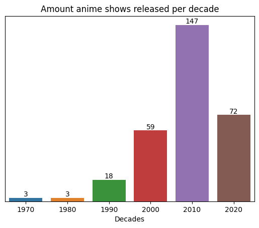

<<<<<<< HEAD
<h1> Analysis 
<h2>  For TV Shows

 

 The folowing sections incluedes graphs aswell as interpretation of said graphs

<!-- 
    General Layout

#### (All cunt)
#### Premiered Season
#### Broadcast days
#### Studio
#### Age Rating
#### Genres
#### Producers
#### Demograph (All cunt)
#### Themes
#### Source
 -->

------
### __Release Stats__

#### &emsp; All Months Releases
The following graph shows in which months animes the most animes were releases.

=======
# Analysis 
## For TV Shows

The folowing sections incluedes graphs aswell as interpretation of said graphs

------
### Release Stats

#### All Releases
The following graph shows in which months animes the most animes were releases.

>>>>>>> e26834888ca41b3da1c98c1db975a887fae8ecfd

According to this graph animes are released every 3 months, or quaterly.

<<<<<<< HEAD
#### &emsp; Seasonly

The following graph shows the amount of top animes was released in each season

=======
#### Seasonly

The following graph shows the amount of top animes was released in each season

>>>>>>> e26834888ca41b3da1c98c1db975a887fae8ecfd

We can see that the most animes were released in Fall, followed by Spring, Winter and Summer.

<<<<<<< HEAD
#### &emsp; Decades
<!--  -->

#### &nbsp; Broadcast days
#### &nbsp; Studio
#### &nbsp; Age Rating
#### &nbsp; Genres
#### &nbsp; Producers
#### &nbsp; Demograph (All cunt)
#### &nbsp; Themes
#### &nbsp; Source

<!------------------------>
------
### __Rating Stats__
=======

#### Decades

------

### Rating Stats
>>>>>>> e26834888ca41b3da1c98c1db975a887fae8ecfd
This is the avr ratings of all animes

#### All

<<<<<<< HEAD
#### &nbsp; Premiered
##### &emsp; Season

###### &emsp; Montly

###### &emsp; Yearly (decade)

#### &nbsp; Broadcast days
#### &nbsp; Studio
#### &nbsp; Age Rating
#### &nbsp; Genres
#### &nbsp; Producers
#### &nbsp; Demograph (All cunt)
#### &nbsp; Themes
#### &nbsp; Source

<!-------------------------------------------------------------------------------------------->
------
### _Broadcast Stats_

#### &emsp; Weekly

#### &emsp; Seasonly

#### &emsp; Yearly

#### &nbsp; Premiered Season
#### &nbsp; Broadcast days
#### &nbsp; Studio
#### &nbsp; Age Rating
#### &nbsp; Genres
#### &nbsp; Producers
#### &nbsp; Demograph (All cunt)
#### &nbsp; Themes
#### &nbsp; Source

<!-------------------------------------------------------------------------------------------->
------
### _Studio Stats_

#### All

Better release count img

=======
#### Seasonly

#### Montly

#### Yearly (decade)

------
### Broadcast Stats

------
### Studio Stats

------
### Age Rating Stats

#### All
>>>>>>> e26834888ca41b3da1c98c1db975a887fae8ecfd
#### Yearly
#### Seasonly

<<<<<<< HEAD
<!--  -->

#### &nbsp; Premiered Season
#### &nbsp; Broadcast days
#### &nbsp; Studio
#### &nbsp; Age Rating
#### &nbsp; Genres
#### &nbsp; Producers
#### &nbsp; Demograph (All cunt)
#### &nbsp; Themes
#### &nbsp; Source

<!-------------------------------------------------------------------------------------------->
------
### __Age Rating Stats__

#### All

#### Better Graph

#### Seasonly

#### &nbsp; Premiered Season
#### &nbsp; Broadcast days
#### &nbsp; Studio
#### &nbsp; Age Rating
#### &nbsp; Genres
#### &nbsp; Producers
#### &nbsp; Demograph (All cunt)
#### &nbsp; Themes
#### &nbsp; Source

<!-------------------------------------------------------------------------------------------->
------
### _Genre Stats_

#### All

#### Yearly

=======
------
### Genre Stats

#### All
#### Yearly
>>>>>>> e26834888ca41b3da1c98c1db975a887fae8ecfd
#### Seasonly

------
<<<<<<< HEAD
<h3> Producers Stats

#### Premiered Season
##### Yearly
##### Seasonly

#### &nbsp; Broadcast days
#### &nbsp; Studio
#### &nbsp; Age Rating
#### &nbsp; Genres
#### &nbsp; Producers
#### &nbsp; Demograph (All cunt)
#### &nbsp; Themes
#### &nbsp; Source

------ 
<!-------------------------------------------------------------------------------------------->
### __Demograph Stats__

#### All counts

#### &nbsp; Premiered Season

#### &nbsp; Demograph Broadcast days

#### &nbsp; Demograph Studio
<!--  -->

#### &nbsp; Demograph Age Rating

#### &nbsp; Demograph Genres
#### &nbsp; Demograph Producers

#### &esmp; Demograph Themes
#### &esmp; Demograph Source

<!-------------------------------------------------------------------------------------------->
------
### __Theme Stats__

#### All 

#### More | Less than 10
#### &nbsp; Seasonly

#### &nbsp; Premiered Season
#### &nbsp; Broadcast days
#### &nbsp; Studio
#### &nbsp; Age Rating
#### &nbsp; Genres
#### &nbsp; Producers
#### &nbsp; Demograph (All cunt)
#### &nbsp; Themes
#### &nbsp; Source

<!-------------------------------------------------------------------------------------------->
------
### __Source Stats__

#### &nbsp; All
#### &emsp; Yearly
#### &emsp; Seasonly

#### &nbsp; Premiered Season
#### &nbsp; Broadcast days
#### &nbsp; Studio
#### &nbsp; Age Rating
#### &nbsp; Genres
#### &nbsp; Producers
#### &nbsp; Demograph (All cunt)
#### &nbsp; Themes
#### &nbsp; Source
=======
### Producers Stats

#### All
#### Yearly
#### Seasonly

------
### Demograph Stats

#### All
#### Yearly
#### Seasonly

------
### Theme Stats

#### All
#### Yearly
#### Seasonly

------
### Source Stats

#### All
#### Yearly
#### Seasonly

>>>>>>> e26834888ca41b3da1c98c1db975a887fae8ecfd
