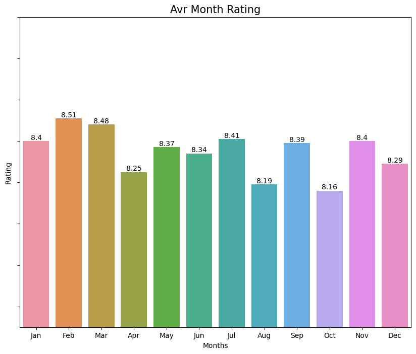

<h1> Analysis 
<h2>  For TV Shows

 

 The folowing sections incluedes graphs aswell as interpretation of said graphs

<!-- 
    General Layout

#### (All cunt)
#### Premiered Season
#### Broadcast days
#### Studio
#### Age Rating
#### Genres
#### Producers
#### Demograph (All cunt)
#### Themes
#### Source
 -->

------
<h3>  Release Stats

#### All Months Releases
The following graph shows in which months animes the most animes were releases.

According to this graph animes are released every 3 months, or quaterly.

#### Seasonly

The following graph shows the amount of top animes was released in each season

We can see that the most animes were released in Fall, followed by Spring, Winter and Summer.

#### Decades
<!--  -->

#### Broadcast days
#### Studio
#### Age Rating
#### Genres
#### Producers
#### Demograph (All cunt)
#### Themes
#### Source

<!------------------------>
------
### Rating Stats
This is the avr ratings of all animes

#### All

#### Premiered
##### Season

###### Montly

###### Yearly (decade)

#### Broadcast days
#### Studio
#### Age Rating
#### Genres
#### Producers
#### Demograph (All cunt)
#### Themes
#### Source

<!-------------------------------------------------------------------------------------------->
------
### Broadcast Stats

#### Weekly

#### Seasonly

#### Yearly

#### Premiered Season
#### Broadcast days
#### Studio
#### Age Rating
#### Genres
#### Producers
#### Demograph (All cunt)
#### Themes
#### Source

<!-------------------------------------------------------------------------------------------->
------
### Studio Stats

#### All

Better release count img

#### Yearly
#### Seasonly

<!--  -->

#### Premiered Season
#### Broadcast days
#### Studio
#### Age Rating
#### Genres
#### Producers
#### Demograph (All cunt)
#### Themes
#### Source

<!-------------------------------------------------------------------------------------------->
------
<h3> Age Rating Stats

#### All

#### Better Graph

#### Seasonly

#### Premiered Season
#### Broadcast days
#### Studio
#### Age Rating
#### Genres
#### Producers
#### Demograph (All cunt)
#### Themes
#### Source

<!-------------------------------------------------------------------------------------------->
------
<h3> Genre Stats

#### All

#### Yearly

#### Seasonly

------
<h3> Producers Stats

#### Premiered Season
##### Yearly
##### Seasonly

#### Broadcast days
#### Studio
#### Age Rating
#### Genres
#### Producers
#### Demograph (All cunt)
#### Themes
#### Source

------ 
<!-------------------------------------------------------------------------------------------->
<h3> Demograph Stats

#### All counts

#### Premiered Season

#### Demograph Broadcast days

#### Demograph Studio
<!--  -->

#### Demograph Age Rating

#### Demograph Genres
#### Demograph Producers

#### Demograph Themes
#### Demograph Source

<!-------------------------------------------------------------------------------------------->
------
<h3>  Theme Stats

#### All 

#### More | Less than 10
#### Seasonly

#### Premiered Season
#### Broadcast days
#### Studio
#### Age Rating
#### Genres
#### Producers
#### Demograph (All cunt)
#### Themes
#### Source

<!-------------------------------------------------------------------------------------------->
------
<h3>  Source Stats

#### All
#### Yearly
#### Seasonly

#### Premiered Season
#### Broadcast days
#### Studio
#### Age Rating
#### Genres
#### Producers
#### Demograph (All cunt)
#### Themes
#### Source